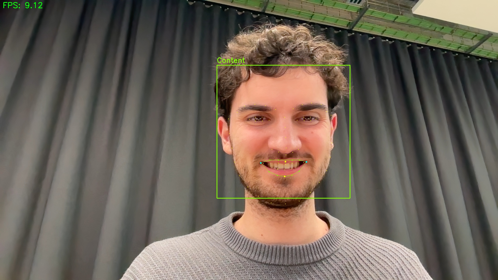
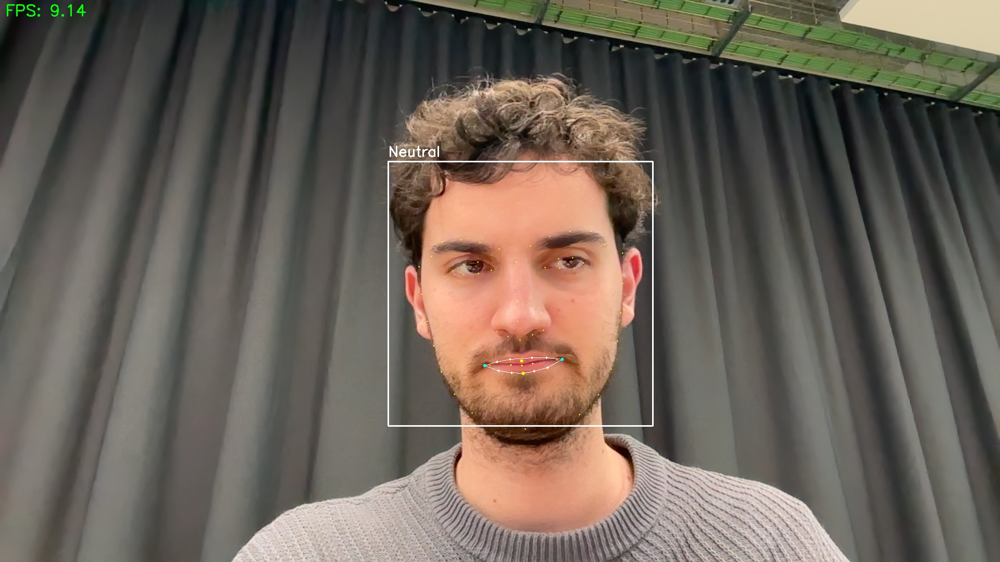
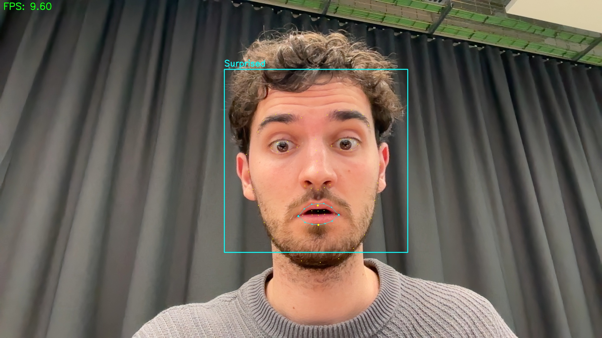

# 👤 Real-Time Emotion Detection

<div align="center">


A sophisticated emotion detection system that uses computer vision and facial landmarks to recognize and analyze facial expressions in real-time.

</div>

## ✨ Features

### 🎯 Advanced Emotion Detection
- **14 Distinct Emotions**:
  - Positive: Joyful, Very Happy, Amused, Content
  - Negative: Angry, Frustrated, Disappointed, Sad
  - Complex: Concerned, Confused, Pensive
  - Other: Surprised, Focused, Neutral
- Real-time emotion classification with color-coded feedback
- Facial landmark visualization (68 points)
- Smile intensity measurement

### 🔍 Detection Metrics
- Eye aspect ratio analysis
- Mouth aspect ratio tracking
- Eyebrow position monitoring
- Smile symmetry checking
- Brow furrow detection

### 🎮 Interactive Controls
- Real-time parameter adjustment with trackbars
- Facial landmark visualization
- Video recording capability
- Screenshot functionality

### 📊 Performance Features
- Real-time FPS counter
- Optimized detection algorithms
- Adjustable detection sensitivity
- Visual feedback system

## 📸 Screenshots

### Emotion Detection Examples

*Detection of happy expression with facial landmarks*


*Neutral expression detection with feature points*


*Detection of concerned expression with visual feedback*

## 🚀 Installation

### Prerequisites
- Python 3.x
- Webcam or camera device
- Required Python packages

### Setup Steps

1. **Clone the Repository**
   ```bash
   git clone https://github.com/yourusername/face_detection.git
   cd face_detection
   ```

2. **Install Dependencies**
   ```bash
   pip install -r requirements.txt
   ```

3. **Download Facial Landmarks Predictor**
   ```bash
   curl -L "https://github.com/italojs/facial-landmarks-recognition/raw/master/shape_predictor_68_face_landmarks.dat" -o shape_predictor_68_face_landmarks.dat
   ```

## 🎮 Usage

### Running the Application
```bash
python face_detection.py
```

### Controls
| Key | Action |
|-----|--------|
| `r` | Start/stop recording |
| `s` | Take screenshot |
| `q` | Quit application |

### Adjustable Parameters
- **Min Neighbors**: Controls detection sensitivity
- **Scale Factor**: Adjusts detection scale
- Real-time visual feedback for all parameters

## 💾 Output Files

All outputs are automatically saved in the `output` directory:
- Screenshots: `screenshot_YYYYMMDD_HHMMSS.jpg`
- Recordings: `recording_YYYYMMDD_HHMMSS.avi`

## 🔬 Technical Details

### Emotion Detection Metrics
- Eye Aspect Ratio (EAR) for eye state detection
- Mouth Aspect Ratio (MAR) for mouth expression
- Facial Landmark Analysis for precise feature tracking
- Smile Intensity Measurement
- Eyebrow Position Tracking
- Furrow Detection Algorithm

### Color Coding
- Green: Positive emotions (Happy, Joyful)
- Red: Negative emotions (Angry, Sad)
- Orange: Complex emotions (Concerned, Confused)
- White: Neutral state
- Purple: Disappointed
- Yellow: Surprised

## 🤝 Contributing

Contributions are welcome! Here's how you can help:
1. Fork the repository
2. Create a feature branch (`git checkout -b feature/improvement`)
3. Make your changes
4. Commit (`git commit -am 'Add new feature'`)
5. Push (`git push origin feature/improvement`)
6. Create a Pull Request

## 📄 License

This project is licensed under the MIT License - see the [LICENSE](LICENSE) file for details.

## 🙏 Acknowledgments

- OpenCV for computer vision capabilities
- dlib for facial landmark detection
- scipy for mathematical computations
- The open-source community for various resources and inspiration
